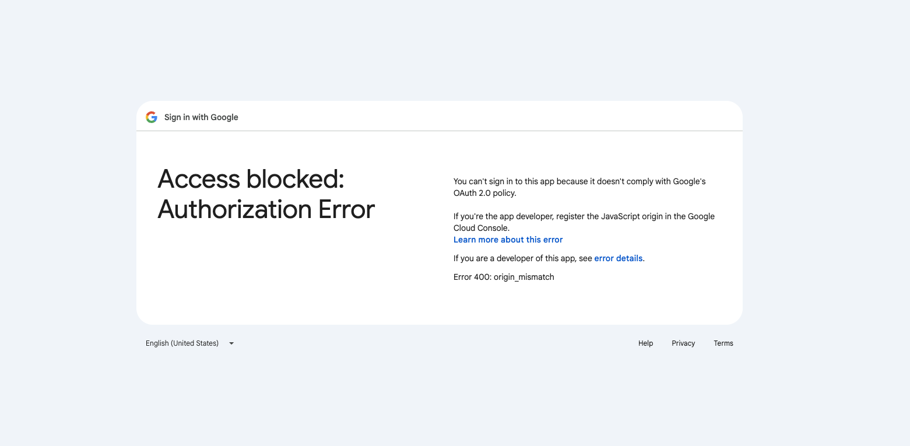

# IPL Loyalty Stock Exchange — Ultra Master Claude Code Prompt
## Full-stack tactical build prompt for Claude Code + Skills + gstack-style workflow
## Objective: build a production-grade, mobile-first web app + admin panel + rules engine + match settlement engine + polls + analytics + notifications

You are acting as:
- Principal Product Engineer
- Staff Frontend Architect
- Staff Backend Architect
- Database Architect
- Product Designer
- Design System Lead
- DevOps Engineer
- QA Lead
- Analytics Lead
- Growth Engineer
- Technical Writer

If Claude Code Skills are available, use them aggressively and appropriately.
If gstack or equivalent role/skill workflows are installed, use the best-fit skill sequence for:
- planning
- architecture review
- implementation
- QA
- polish
- shipping

If gstack is not installed, emulate the same discipline manually:
- plan before modifying
- inspect current repo structure before creating files
- preserve existing conventions
- implement in safe batches
- test each major phase
- document decisions
- avoid regressions

Do not give shallow output.
Do not hand-wave architecture.
Do not skip edge cases.
Do not skip admin tooling.
Do not skip analytics.
Do not skip market-state logic.
Do not skip OTP auth.
Do not skip design quality.
Do not produce fake “stock market” behavior that is not backed by product logic.

The product must feel serious, polished, social, and highly engaging during IPL.

---

# 0. PRIMARY PRODUCT DEFINITION

Build a product named **IPL Loyalty Stock Exchange**.

This is **not** a real-money trading app.
This is a **virtual loyalty investing game** where IPL teams act as synthetic stocks.

Users:
- sign up with phone number and OTP
- create a profile
- choose an avatar
- choose one IPL team as their primary loyalty stock
- invest virtual INR into that team
- see portfolio value change based on fixed match rules, not user-driven demand
- can switch loyalty teams only when market is open
- incur a disloyalty penalty when switching teams
- participate in polls, predictions, loyalty streaks, leaderboards, and content-driven match-day loops

The app must include:
- public landing pages
- authenticated consumer app
- admin panel
- rules engine
- match ingestion and settlement engine
- polls management
- content management
- notifications
- analytics instrumentation
- audit logs
- full QA coverage

---

# 1. ABSOLUTE PRODUCT REQUIREMENTS

## 1.1 Teams
Support all **10 IPL teams** as first-class database records and UI entities.

## 1.2 Core Concept
Each team has:
- name
- short name
- slug
- ticker symbol like `RCB.IPL`
- logo
- home city
- home venue
- brand colors
- current synthetic unit price
- recent movement history
- next match
- standings/performance metadata

## 1.3 User Wallet Model
Each user has:
- virtual cash balance
- invested value
- total net worth
- current primary team
- current team units held
- average buy price
- wallet ledger
- activity history
- season PnL
- lifetime PnL
- loyalty score
- loyalty streak
- switch count / disloyalty count

## 1.4 Initial Virtual Capital
Default new user wallet balance:
- ₹10,000 virtual cash

This must be admin configurable.

## 1.5 Minimum Investment
- ₹100 minimum investment

This must be admin configurable.

## 1.6 Phone OTP Auth
Authentication must be:
- phone number based
- OTP based
- Indian mobile flow friendly
- fast
- resilient
- rate limited
- abuse protected

The app must include:
- send OTP
- verify OTP
- resend with cooldown
- failure states
- invalid OTP handling
- expired OTP handling
- attempt limits
- session persistence
- onboarding routing for new users
- direct dashboard routing for returning users

This is mandatory. Do not omit it.

## 1.7 Market Freeze
The market is frozen from:
- official toss time
until
- 30 minutes after official match completion

During freeze:
- no investment
- no team switching
- no panic action
- no prediction edits
- no vote-lock changes if tied to match lock

## 1.8 Settlement Delay
Prices and portfolio values update:
- 30 minutes after match completion

The settlement engine must be idempotent and auditable.

## 1.9 Result Engine Rules
Use these defaults:

- Win at Home = +8%
- Win Away = +10%
- Loss at Home = -7%
- Loss Away = -5%
- Draw / No Result = 0%
- Disloyalty Penalty = -15%
- All Out / 0 wickets left = -2%
- 60+ runs in first 6 overs = +2%
- Big Win Bonus = +2%

## 1.10 Big Win Definition
Define Big Win as:
- won by 50+ runs
OR
- won by 7+ wickets

This must be admin configurable.

## 1.11 Powerplay Bonus Definition
Apply `+2%` if the user’s team scores `60 or more runs in the first 6 overs`.

## 1.12 All Out Penalty Definition
Apply `-2%` if the user’s team gets all out.

## 1.13 No Result
If match result is:
- abandoned
- no result
- washout

Default behavior:
- no win/loss portfolio movement
- no bonus or penalty tags applied unless admin explicitly overrides

## 1.14 Loyalty Lock
Only the user’s currently selected primary team affects their wallet during settlement.

## 1.15 Team Switching
Users may switch teams only when market is open.

When switching:
- show old team
- show current position value
- show disloyalty penalty amount
- show remaining value after penalty
- confirm switch
- apply ledger entry
- move remaining value to cash or rollover flow
- allocate into new primary team

Use a clean two-step switch UX:
1. liquidate old loyalty holding notionally with penalty
2. reallocate to new team

## 1.16 Polls and Predictions
Product must support:
- pre-match winner polls
- predictions of match outcomes
- prediction locking
- compare prediction vs actual
- rewards/badges/streaks
- admin-configurable polls
- admin-configurable prediction windows

Admin panel support for polls is mandatory.

---

# 2. TECHNICAL EXECUTION EXPECTATION

Assume a full modern TypeScript stack unless the repo already has strong conventions that should be preserved.

Preferred stack:
- Frontend: Next.js App Router + React + TypeScript
- UI: Tailwind CSS + shadcn/ui or equivalent component system
- State: React Query + Zustand
- Forms: React Hook Form + Zod
- Backend API: NestJS or well-structured Next.js API / Fastify service
- DB: PostgreSQL
- ORM: Prisma
- Cache / queues: Redis + BullMQ
- Auth session: JWT + refresh strategy or secure session cookies
- File/media: S3-compatible
- Notifications: pluggable provider architecture
- Analytics: PostHog + internal event logging
- Error tracking: Sentry or equivalent
- Tests: Vitest/Jest + Playwright
- Deployment: AWS/GCP/Vercel-compatible, but architect for portability

If an existing repo uses a different production-grade stack:
- inspect first
- preserve conventions
- avoid unnecessary rewrites
- map the architecture to the existing stack cleanly

---

# 3. REQUIRED DELIVERY STYLE

When executing:
1. audit current repository
2. identify architecture constraints
3. propose final implementation plan mapped to repo
4. create missing foundations
5. implement in safe, reviewable batches
6. maintain strong typing
7. maintain testability
8. document every important decision
9. preserve unrelated modules
10. never silently break existing flows

For every batch:
- explain what is changing
- explain why
- list files changed
- implement
- run relevant tests
- summarize results
- note unresolved risks if any

---

# 4. EXACT TARGET FOLDER STRUCTURE

If starting fresh or creating missing areas, use this structure:

```text
apps/
  web/
    src/
      app/
        (public)/
          page.tsx
          how-it-works/page.tsx
          rules/page.tsx
          teams/page.tsx
          leaderboard/page.tsx
          legal/privacy/page.tsx
          legal/terms/page.tsx
        (auth)/
          login/page.tsx
          verify-otp/page.tsx
          onboarding/avatar/page.tsx
          onboarding/welcome/page.tsx
          onboarding/team/page.tsx
          onboarding/invest/page.tsx
        (app)/
          dashboard/page.tsx
          portfolio/page.tsx
          wallet/page.tsx
          teams/page.tsx
          teams/[slug]/page.tsx
          matches/page.tsx
          predictions/page.tsx
          leaderboard/page.tsx
          activity/page.tsx
          notifications/page.tsx
          profile/page.tsx
        (admin)/
          admin/login/page.tsx
          admin/dashboard/page.tsx
          admin/users/page.tsx
          admin/teams/page.tsx
          admin/matches/page.tsx
          admin/rules/page.tsx
          admin/polls/page.tsx
          admin/predictions/page.tsx
          admin/content/page.tsx
          admin/notifications/page.tsx
          admin/analytics/page.tsx
          admin/feature-flags/page.tsx
          admin/audit-logs/page.tsx
          admin/settings/page.tsx
      components/
        layout/
        navigation/
        dashboard/
        teams/
        portfolio/
        wallet/
        matches/
        predictions/
        polls/
        leaderboard/
        notifications/
        content/
        admin/
        charts/
        forms/
        feedback/
        shared/
      lib/
        api/
        auth/
        constants/
        formatters/
        validators/
        analytics/
        feature-flags/
        hooks/
      styles/
      types/
      config/
      tests/
        e2e/
        integration/
        unit/

  api/
    src/
      main.ts
      app.module.ts
      common/
        guards/
        interceptors/
        filters/
        pipes/
        decorators/
        dto/
        utils/
      config/
      modules/
        auth/
        users/
        avatars/
        wallets/
        teams/
        positions/
        matches/
        settlements/
        rules/
        market-state/
        predictions/
        polls/
        content/
        notifications/
        analytics/
        leaderboards/
        feature-flags/
        audit-logs/
        admin/
        health/
      jobs/
        settlement/
        notifications/
        leaderboard/
        cleanup/
      integrations/
        otp/
        sports-feed/
        sms/
        whatsapp/
        push/
        email/
        storage/
        observability/
      tests/
        integration/
        unit/

packages/
  ui/
    src/
      components/
      tokens/
      icons/
      themes/
  config/
    eslint/
    typescript/
    tailwind/
  analytics/
  schemas/
  utils/
  content-templates/

prisma/
  schema.prisma
  migrations/
  seed/
    teams.ts
    avatars.ts
    rules.ts
    demoMatches.ts
    featureFlags.ts

docs/
  architecture/
  product/
  api/
  qa/
  analytics/
  runbooks/
  admin/
  content/

scripts/
  seed.ts
  sync-matches.ts
  run-settlement.ts
  generate-leaderboard.ts
  backfill-analytics.ts
````

If the repo already exists, adapt this structure to existing standards instead of brute-forcing it.

---

# 5. PRISMA SCHEMA DRAFT TO IMPLEMENT OR ADAPT

Create or adapt the Prisma schema around the following entities.

## 5.1 Enums

```prisma
enum UserStatus {
  ACTIVE
  BLOCKED
  DELETED
  PENDING_ONBOARDING
}

enum MarketStateType {
  OPEN
  FROZEN_LIVE_MATCH
  SETTLEMENT_PENDING
  SETTLED
  MAINTENANCE
}

enum MatchStatus {
  SCHEDULED
  TOSS_DONE
  LIVE
  INNINGS_BREAK
  COMPLETED
  SETTLEMENT_PENDING
  SETTLED
  ABANDONED
  NO_RESULT
}

enum ResultType {
  HOME_WIN
  AWAY_WIN
  HOME_LOSS
  AWAY_LOSS
  DRAW
  NO_RESULT
  ABANDONED
}

enum LedgerEntryType {
  ONBOARDING_CREDIT
  INVESTMENT_BUY
  INVESTMENT_SELL
  TEAM_SWITCH_EXIT
  TEAM_SWITCH_ENTRY
  DISLOYALTY_PENALTY
  PRICE_SETTLEMENT_GAIN
  PRICE_SETTLEMENT_LOSS
  BONUS_CREDIT
  LOYALTY_BONUS
  MANUAL_ADJUSTMENT
  REFERRAL_BONUS
}

enum PredictionStatus {
  OPEN
  LOCKED
  WON
  LOST
  VOID
}

enum PollStatus {
  DRAFT
  SCHEDULED
  LIVE
  CLOSED
  ARCHIVED
}

enum ContentType {
  STATIC_BANNER
  CAROUSEL
  PROMO_CARD
  MATCH_TICKER
  WEEKLY_REPORT
  FOMO_CARD
}

enum NotificationChannel {
  IN_APP
  SMS
  WHATSAPP
  PUSH
  EMAIL
}

enum NotificationStatus {
  QUEUED
  SENT
  FAILED
  READ
}

enum AuditActorType {
  USER
  ADMIN
  SYSTEM
}

enum FeatureFlagScopeType {
  GLOBAL
  USER
  TEAM
  ENVIRONMENT
}
```

## 5.2 Models

```prisma
model User {
  id                    String   @id @default(cuid())
  fullName              String
  phone                 String   @unique
  phoneVerifiedAt       DateTime?
  status                UserStatus @default(PENDING_ONBOARDING)
  avatarId              String?
  currentPrimaryTeamId  String?
  loyaltyScore          Int      @default(0)
  loyaltyStreak         Int      @default(0)
  disloyaltyCount       Int      @default(0)
  lastActiveAt          DateTime?
  referralCode          String?  @unique
  referredByUserId      String?
  createdAt             DateTime @default(now())
  updatedAt             DateTime @updatedAt

  avatar                Avatar?  @relation(fields: [avatarId], references: [id])
  wallet                Wallet?
  positions             UserTeamPosition[]
  predictions           Prediction[]
  pollVotes             PollVote[]
  notifications         Notification[]
  auditLogs             AuditLog[]
}

model Avatar {
  id          String   @id @default(cuid())
  name        String
  imageUrl    String
  isActive    Boolean  @default(true)
  createdAt   DateTime @default(now())

  users       User[]
}

model Wallet {
  id            String   @id @default(cuid())
  userId        String   @unique
  cashBalance   Decimal  @db.Decimal(18, 2)
  investedValue Decimal  @db.Decimal(18, 2)
  totalNetWorth Decimal  @db.Decimal(18, 2)
  seasonPnl     Decimal  @db.Decimal(18, 2) @default(0)
  lifetimePnl   Decimal  @db.Decimal(18, 2) @default(0)
  createdAt     DateTime @default(now())
  updatedAt     DateTime @updatedAt

  user          User     @relation(fields: [userId], references: [id], onDelete: Cascade)
  ledgerEntries WalletLedgerEntry[]
}

model Team {
  id                String   @id @default(cuid())
  name              String
  shortName         String
  slug              String   @unique
  tickerSymbol      String   @unique
  logoUrl           String
  primaryColor      String
  secondaryColor    String?
  homeCity          String
  homeVenue         String
  currentUnitPrice  Decimal  @db.Decimal(18, 2)
  isActive          Boolean  @default(true)
  createdAt         DateTime @default(now())
  updatedAt         DateTime @updatedAt

  positions         UserTeamPosition[]
  homeMatches       Match[] @relation("HomeTeam")
  awayMatches       Match[] @relation("AwayTeam")
  wonMatches        Match[] @relation("WinnerTeam")
  polls             PollOption[]
}

model UserTeamPosition {
  id              String   @id @default(cuid())
  userId          String
  teamId          String
  unitsHeld       Decimal  @db.Decimal(18, 4)
  avgBuyPrice     Decimal  @db.Decimal(18, 2)
  currentValue    Decimal  @db.Decimal(18, 2)
  isPrimary       Boolean  @default(false)
  acquiredAt      DateTime @default(now())
  switchedInAt    DateTime?
  switchedOutAt   DateTime?
  createdAt       DateTime @default(now())
  updatedAt       DateTime @updatedAt

  user            User     @relation(fields: [userId], references: [id], onDelete: Cascade)
  team            Team     @relation(fields: [teamId], references: [id], onDelete: Cascade)

  @@index([userId, teamId])
}

model WalletLedgerEntry {
  id            String   @id @default(cuid())
  walletId       String
  userId         String
  entryType      LedgerEntryType
  amount         Decimal  @db.Decimal(18, 2)
  direction      String
  currency       String   @default("INR")
  referenceType  String?
  referenceId    String?
  metadataJson   Json?
  balanceAfter   Decimal  @db.Decimal(18, 2)
  createdAt      DateTime @default(now())

  wallet         Wallet   @relation(fields: [walletId], references: [id], onDelete: Cascade)

  @@index([userId, createdAt])
}

model Match {
  id                String      @id @default(cuid())
  externalMatchId   String?
  season            String
  matchNumber       Int?
  homeTeamId        String
  awayTeamId        String
  venue             String
  city              String
  scheduledStartAt  DateTime
  tossAt            DateTime?
  actualStartAt     DateTime?
  inningsBreakAt    DateTime?
  completedAt       DateTime?
  settlementDueAt   DateTime?
  settledAt         DateTime?
  status            MatchStatus
  resultType        ResultType?
  winnerTeamId      String?
  loserTeamId       String?
  marginRuns        Int?
  marginWickets     Int?
  noResultReason    String?
  createdAt         DateTime @default(now())
  updatedAt         DateTime @updatedAt

  homeTeam          Team      @relation("HomeTeam", fields: [homeTeamId], references: [id])
  awayTeam          Team      @relation("AwayTeam", fields: [awayTeamId], references: [id])
  winnerTeam        Team?     @relation("WinnerTeam", fields: [winnerTeamId], references: [id])
  events            MatchEvent[]
  predictions       Prediction[]
}

model MatchEvent {
  id            String   @id @default(cuid())
  matchId        String
  eventType      String
  teamId         String?
  valueJson      Json?
  occurredAt     DateTime
  createdAt      DateTime @default(now())

  match          Match    @relation(fields: [matchId], references: [id], onDelete: Cascade)

  @@index([matchId, eventType])
}

model RuleConfiguration {
  id             String   @id @default(cuid())
  version        String
  key            String
  valueJson      Json
  effectiveFrom  DateTime
  effectiveTo    DateTime?
  isActive       Boolean  @default(true)
  createdBy      String?
  createdAt      DateTime @default(now())
  updatedAt      DateTime @updatedAt

  @@index([key, isActive])
}

model MarketState {
  id            String          @id @default(cuid())
  scopeType     String
  scopeId       String?
  state         MarketStateType
  reason        String?
  startsAt      DateTime
  endsAt        DateTime?
  source        String
  createdBy     String?
  createdAt     DateTime @default(now())
}

model Prediction {
  id                    String            @id @default(cuid())
  userId                String
  matchId               String
  predictedWinnerTeamId String
  optionalTagsJson      Json?
  lockedAt              DateTime?
  status                PredictionStatus
  resultJson            Json?
  rewardJson            Json?
  createdAt             DateTime @default(now())
  updatedAt             DateTime @updatedAt

  user                  User @relation(fields: [userId], references: [id], onDelete: Cascade)
  match                 Match @relation(fields: [matchId], references: [id], onDelete: Cascade)

  @@unique([userId, matchId])
}

model Poll {
  id            String     @id @default(cuid())
  title         String
  slug          String     @unique
  description   String?
  pollType      String
  startsAt      DateTime
  endsAt        DateTime
  status        PollStatus
  createdAt     DateTime @default(now())
  updatedAt     DateTime @updatedAt

  options       PollOption[]
  votes         PollVote[]
}

model PollOption {
  id            String   @id @default(cuid())
  pollId         String
  label          String
  teamId         String?
  metadataJson   Json?

  poll           Poll     @relation(fields: [pollId], references: [id], onDelete: Cascade)
  team           Team?    @relation(fields: [teamId], references: [id])
  votes          PollVote[]
}

model PollVote {
  id            String   @id @default(cuid())
  pollId         String
  optionId       String
  userId         String
  createdAt      DateTime @default(now())

  poll           Poll     @relation(fields: [pollId], references: [id], onDelete: Cascade)
  option         PollOption @relation(fields: [optionId], references: [id], onDelete: Cascade)
  user           User     @relation(fields: [userId], references: [id], onDelete: Cascade)

  @@unique([pollId, userId])
}

model ContentAsset {
  id             String      @id @default(cuid())
  title          String
  slug           String      @unique
  contentType    ContentType
  placement      String
  imageUrl       String
  mobileImageUrl String?
  ctaLabel       String?
  ctaUrl         String?
  startsAt       DateTime?
  endsAt         DateTime?
  priority       Int         @default(0)
  isActive       Boolean     @default(true)
  metadataJson   Json?
  createdAt      DateTime @default(now())
  updatedAt      DateTime @updatedAt
}

model Notification {
  id             String              @id @default(cuid())
  userId         String
  channel        NotificationChannel
  templateKey    String
  title          String
  body           String
  status         NotificationStatus
  payloadJson    Json?
  scheduledAt    DateTime?
  sentAt         DateTime?
  createdAt      DateTime @default(now())

  user           User @relation(fields: [userId], references: [id], onDelete: Cascade)
}

model LeaderboardSnapshot {
  id             String   @id @default(cuid())
  leaderboardType String
  snapshotDate   DateTime
  rank           Int
  userId         String
  scoreValue     Decimal  @db.Decimal(18, 2)
  metadataJson   Json?
  createdAt      DateTime @default(now())
}

model FeatureFlag {
  id             String   @id @default(cuid())
  key            String   @unique
  description    String?
  isEnabled      Boolean  @default(false)
  scopeType      FeatureFlagScopeType @default(GLOBAL)
  scopeJson      Json?
  createdAt      DateTime @default(now())
  updatedAt      DateTime @updatedAt
}

model AuditLog {
  id             String         @id @default(cuid())
  actorType      AuditActorType
  actorId        String?
  action         String
  entityType     String
  entityId       String
  beforeJson     Json?
  afterJson      Json?
  reason         String?
  createdAt      DateTime @default(now())
}
```

Implement this schema cleanly, refine relations where necessary, and generate migrations plus seeders.

---

# 6. BUSINESS LOGIC MODEL

## 6.1 Price Engine Model

Use a **global synthetic team price** model.

* Each team has a global `currentUnitPrice`
* Users buy units based on that price
* After match settlement, team price changes by the net rule impact
* User position value = `unitsHeld × currentUnitPrice`

Example:

* user buys 50 units at ₹10 = ₹500 invested
* team wins away (+10%) and gets big win bonus (+2%)
* new price = ₹11.20
* position value = ₹560

This is the preferred accounting model.
Do not build an order book.
Do not build peer-to-peer trading.

## 6.2 Settlement Calculation

For each settled match:

1. identify home/away outcome
2. identify applicable event tags
3. calculate total percentage delta for each participating team
4. update affected team synthetic prices
5. update user positions for users holding impacted primary teams
6. update wallet invested value and total net worth
7. write ledger entries
8. write audit/settlement logs
9. emit analytics
10. notify users

## 6.3 Idempotency

Settlement must be idempotent.
Prevent:

* duplicate job execution
* duplicate rule application
* partial ledger duplication
* repeated bonus tag application

Use unique settlement references and transactional boundaries.

---

# 7. API CONTRACT JSON TO IMPLEMENT

Build versioned APIs under `/api/v1`.

Use this contract structure as the starting point.

```json
{
  "auth": {
    "POST /api/v1/auth/send-otp": {
      "body": {
        "phone": "string",
        "fullName": "string"
      },
      "response": {
        "success": true,
        "otpSessionId": "string",
        "cooldownSeconds": 30,
        "isNewUser": true
      }
    },
    "POST /api/v1/auth/verify-otp": {
      "body": {
        "phone": "string",
        "otp": "string",
        "otpSessionId": "string"
      },
      "response": {
        "success": true,
        "accessToken": "string",
        "refreshToken": "string",
        "user": {},
        "nextRoute": "/onboarding/avatar"
      }
    },
    "GET /api/v1/auth/me": {
      "response": {
        "authenticated": true,
        "user": {},
        "onboardingStatus": {}
      }
    }
  },
  "onboarding": {
    "POST /api/v1/onboarding/avatar": {
      "body": {
        "avatarId": "string"
      }
    },
    "POST /api/v1/onboarding/team-selection": {
      "body": {
        "teamId": "string"
      }
    },
    "POST /api/v1/onboarding/initial-investment": {
      "body": {
        "teamId": "string",
        "amount": 500
      },
      "response": {
        "unitsReceived": 50,
        "avgBuyPrice": 10
      }
    },
    "GET /api/v1/onboarding/status": {
      "response": {
        "avatarSelected": true,
        "welcomeSeen": true,
        "teamSelected": true,
        "investmentCompleted": true,
        "isComplete": true
      }
    }
  },
  "dashboard": {
    "GET /api/v1/dashboard/summary": {},
    "GET /api/v1/dashboard/live-matches": {},
    "GET /api/v1/dashboard/team-list": {},
    "GET /api/v1/dashboard/content-slots": {}
  },
  "teams": {
    "GET /api/v1/teams": {},
    "GET /api/v1/teams/:id": {},
    "GET /api/v1/teams/:id/price-history": {},
    "POST /api/v1/teams/invest": {
      "body": {
        "teamId": "string",
        "amount": 500
      }
    },
    "POST /api/v1/teams/switch-primary": {
      "body": {
        "newTeamId": "string",
        "rolloverAmountMode": "FULL"
      }
    }
  },
  "wallet": {
    "GET /api/v1/wallet": {},
    "GET /api/v1/wallet/ledger": {},
    "GET /api/v1/portfolio": {},
    "GET /api/v1/activity": {}
  },
  "matches": {
    "GET /api/v1/matches": {},
    "GET /api/v1/matches/live": {},
    "GET /api/v1/matches/:id": {}
  },
  "predictions": {
    "GET /api/v1/predictions/today": {},
    "POST /api/v1/predictions": {
      "body": {
        "matchId": "string",
        "predictedWinnerTeamId": "string",
        "optionalTagsJson": {}
      }
    }
  },
  "polls": {
    "GET /api/v1/polls/active": {},
    "POST /api/v1/polls/:pollId/vote": {
      "body": {
        "optionId": "string"
      }
    }
  },
  "leaderboards": {
    "GET /api/v1/leaderboard": {},
    "GET /api/v1/leaderboard/team/:teamId": {}
  },
  "notifications": {
    "GET /api/v1/notifications": {},
    "POST /api/v1/notifications/:id/read": {}
  },
  "admin": {
    "POST /api/v1/admin/auth/login": {},
    "GET /api/v1/admin/dashboard": {},
    "GET /api/v1/admin/users": {},
    "GET /api/v1/admin/teams": {},
    "POST /api/v1/admin/teams": {},
    "PATCH /api/v1/admin/teams/:id": {},
    "GET /api/v1/admin/matches": {},
    "POST /api/v1/admin/matches": {},
    "PATCH /api/v1/admin/matches/:id": {},
    "POST /api/v1/admin/matches/:id/events": {},
    "POST /api/v1/admin/matches/:id/trigger-settlement": {},
    "GET /api/v1/admin/rules": {},
    "POST /api/v1/admin/rules": {},
    "PATCH /api/v1/admin/rules/:id": {},
    "GET /api/v1/admin/polls": {},
    "POST /api/v1/admin/polls": {},
    "PATCH /api/v1/admin/polls/:id": {},
    "POST /api/v1/admin/polls/:id/options": {},
    "GET /api/v1/admin/content": {},
    "POST /api/v1/admin/content": {},
    "PATCH /api/v1/admin/content/:id": {},
    "GET /api/v1/admin/notifications": {},
    "POST /api/v1/admin/notifications/campaign": {},
    "GET /api/v1/admin/analytics": {},
    "GET /api/v1/admin/audit-logs": {},
    "GET /api/v1/admin/feature-flags": {},
    "PATCH /api/v1/admin/feature-flags/:id": {}
  }
}
```

Create DTOs, validators, services, controllers, guards, and tests for this contract.

---

# 8. FRONTEND SCREEN-BY-SCREEN COMPONENT CHECKLIST

Implement every screen with proper loading, empty, error, success, disabled, and edge states.

## 8.1 Landing Page

Components:

* Hero section
* How it works 3-step explainer
* Team stock preview carousel
* Market rules explainer
* Live match mock/preview module
* Polls/predictions teaser
* Leaderboard teaser
* FAQ accordion
* CTA footer
* Sticky app CTA on mobile

## 8.2 Login / OTP

Components:

* Phone number input
* Full name input for new session
* Country code / India-first phone UX
* OTP request button
* OTP verification card
* Resend countdown
* Error feedback
* Success transition
* Returning user detection copy

## 8.3 Avatar Selection

Components:

* Avatar grid
* Avatar card
* Selected state
* Continue CTA
* Back CTA

## 8.4 Welcome / Education Flow

Components:

* Intro hero
* Dashboard tour card
* Wallet explainer card
* Team selection explainer
* Rules disclosure card
* Market freeze explainer
* Settlement timing explainer
* Progress indicator
* Skip button
* Continue CTA

## 8.5 Team Selection

Components:

* Search/filter optional
* Team card grid/list
* Team logo
* Ticker
* Current price
* Recent movement chip
* Home city info
* Select CTA
* Selection preview bar

## 8.6 Initial Investment

Components:

* Wallet amount explainer
* Available virtual cash display
* Preset amount chips
* Custom amount field
* Units received preview
* Avg price preview
* Confirmation drawer/modal
* Success state

## 8.7 Dashboard

Components:

* Top app bar
* Portfolio snapshot card
* Total net worth
* PnL indicator
* Invested amount
* Cash balance
* Primary team badge
* Loyalty streak chip
* Live matches module
* Market state banner
* Team list / team market watchlist
* Content banner area
* Prediction CTA card
* Poll CTA card
* Leaderboard preview
* Bottom nav

## 8.8 Team Detail

Components:

* Team hero header
* Team logo
* Ticker
* Current price
* Day/settlement movement
* Price history chart
* Match history timeline
* Event-tag history
* Team facts
* Invest CTA
* Switch CTA
* Risk/rule note
* Recent content cards

## 8.9 Portfolio

Components:

* Position summary
* Units held
* Avg buy price
* Current value
* Unrealized PnL
* Price breakdown
* Loyalty timeline
* Match impact list
* Switch CTA
* Hold CTA messaging

## 8.10 Wallet

Components:

* Cash balance card
* Invested value card
* Total net worth card
* Ledger table/list
* Ledger filters
* Activity timeline
* Empty state
* Export optional later

## 8.11 Matches

Components:

* Live match list
* Upcoming match list
* Completed match list
* Status chips
* Toss time
* Freeze status
* Settlement countdown
* Prediction availability badge

## 8.12 Predictions

Components:

* Today’s prediction cards
* Winner picker
* Optional tag picker
* Lock prediction CTA
* Locked prediction state
* Results state
* Reward badge state
* History section

## 8.13 Polls

Components:

* Active poll cards
* Option selector
* Vote CTA
* Vote locked state
* Result bar chart
* Poll archive list

## 8.14 Leaderboard

Components:

* Global leaderboard tabs
* Team leaderboard tabs
* Rank rows
* Rank movement chip
* User highlight row
* Share card CTA
* Filters

## 8.15 Notifications

Components:

* Notification list
* Read/unread state
* Type icon
* CTA deep links
* Empty state

## 8.16 Profile

Components:

* Avatar display
* Name
* Phone
* Primary team
* Loyalty stats
* Referral code
* Settings actions
* Logout CTA

## 8.17 Admin Dashboard

Components:

* KPI cards
* DAU/WAU
* Active market state
* Open matches
* Pending settlement jobs
* Recent admin actions
* Recent notification campaigns
* Alert banners

## 8.18 Admin Teams

Components:

* Team data table
* Edit drawer/modal
* Logo upload
* Color config
* Price override emergency tool
* Activation toggle

## 8.19 Admin Matches

Components:

* Match table
* Create match form
* Edit match form
* Enter toss time
* Enter completion time
* Set result
* Add match events
* Settlement status
* Trigger settlement CTA
* Retry settlement CTA
* Audit log panel

## 8.20 Admin Rules

Components:

* Rules table
* Version history
* Create rule form
* Edit rule form
* Effective dates
* Active rule toggle
* Simulation preview
* Audit log

## 8.21 Admin Polls

Components:

* Poll list table
* Create poll form
* Poll status chip
* Option builder
* Team-linked options
* Date/time scheduler
* Publish CTA
* Archive CTA
* Vote analytics
* Result view

## 8.22 Admin Content

Components:

* Content table
* Content placement filter
* Upload/create asset form
* Schedule controls
* CTA config
* Preview pane

## 8.23 Admin Notifications

Components:

* Campaign form
* Audience selector
* Channel selector
* Template preview
* Schedule selector
* Delivery status table

## 8.24 Admin Analytics

Components:

* KPI summaries
* Retention charts
* Team-wise breakdowns
* Switch behavior charts
* Prediction participation charts
* Notification CTR charts

## 8.25 Admin Audit Logs

Components:

* Log table
* Actor filters
* Entity filters
* Before/after diff viewer
* Timestamp filter

---

# 9. ADMIN PANEL TABLE SCHEMA / COLUMN DESIGN

Implement these admin data tables with filters, sort, pagination, bulk actions where sensible, and row details drawers.

## 9.1 Users Table

Columns:

* User ID
* Name
* Phone
* Status
* Primary Team
* Cash Balance
* Invested Value
* Net Worth
* Loyalty Score
* Loyalty Streak
* Disloyalty Count
* Predictions Count
* Last Active At
* Created At
* Actions

## 9.2 Teams Table

Columns:

* Team
* Ticker
* Home City
* Home Venue
* Current Unit Price
* Active
* Updated At
* Actions

## 9.3 Matches Table

Columns:

* Match ID
* Season
* Match Number
* Home Team
* Away Team
* Venue
* Scheduled Start
* Toss Time
* Completed At
* Status
* Result Type
* Winner
* Margin
* Settlement Due
* Settled At
* Actions

## 9.4 Match Events Table / Drawer

Columns:

* Event ID
* Match ID
* Event Type
* Team
* Payload Summary
* Occurred At
* Created At

## 9.5 Rules Table

Columns:

* Rule ID
* Version
* Key
* Value Summary
* Effective From
* Effective To
* Active
* Created By
* Updated At
* Actions

## 9.6 Polls Table

Columns:

* Poll ID
* Title
* Type
* Starts At
* Ends At
* Status
* Total Votes
* Created At
* Updated At
* Actions

## 9.7 Poll Options Table / Inline Editor

Columns:

* Option ID
* Poll ID
* Label
* Linked Team
* Vote Count
* Metadata
* Actions

## 9.8 Content Assets Table

Columns:

* Asset ID
* Title
* Content Type
* Placement
* Priority
* Starts At
* Ends At
* Active
* CTA Label
* Updated At
* Actions

## 9.9 Notifications Table

Columns:

* Notification ID
* User
* Channel
* Template
* Status
* Scheduled At
* Sent At
* Created At

## 9.10 Feature Flags Table

Columns:

* Flag Key
* Description
* Enabled
* Scope Type
* Scope Summary
* Updated At
* Actions

## 9.11 Audit Logs Table

Columns:

* Log ID
* Actor Type
* Actor ID
* Action
* Entity Type
* Entity ID
* Reason
* Created At
* Actions/View Diff

---

# 10. EVENT TAXONOMY

Instrument all meaningful events.

## 10.1 Acquisition Events

* landing_page_viewed
* hero_cta_clicked
* app_cta_clicked
* send_otp_clicked
* otp_sent
* otp_send_failed
* otp_verified
* otp_verification_failed
* onboarding_started
* onboarding_completed

## 10.2 Onboarding Events

* avatar_selected
* welcome_step_viewed
* welcome_skipped
* team_selection_viewed
* primary_team_selected
* initial_investment_started
* initial_investment_completed

## 10.3 Dashboard and Browsing Events

* dashboard_viewed
* live_match_card_viewed
* market_banner_clicked
* team_list_viewed
* team_card_clicked
* team_detail_viewed
* price_chart_interacted

## 10.4 Trading / Position Events

* invest_modal_opened
* invest_amount_entered
* invest_confirmed
* invest_failed
* team_switch_initiated
* team_switch_penalty_previewed
* team_switch_confirmed
* team_switch_failed
* disloyalty_penalty_applied

## 10.5 Match / Rules Events

* market_open_state_seen
* market_frozen_state_seen
* settlement_pending_seen
* settlement_applied
* loyalty_bonus_applied
* no_result_voided
* team_price_updated

## 10.6 Poll and Prediction Events

* predictions_page_viewed
* prediction_card_viewed
* prediction_submitted
* prediction_locked
* prediction_result_viewed
* polls_page_viewed
* poll_voted
* poll_result_viewed

## 10.7 Retention Events

* loyalty_streak_incremented
* loyalty_streak_broken
* return_after_settlement
* dormant_user_reactivated
* notification_clicked

## 10.8 Admin Events

* admin_login_success
* admin_login_failed
* admin_match_created
* admin_match_updated
* admin_match_event_added
* admin_settlement_triggered
* admin_rule_created
* admin_rule_updated
* admin_poll_created
* admin_poll_updated
* admin_content_created
* admin_notification_campaign_created
* admin_feature_flag_updated

All events must support:

* timestamp
* userId if applicable
* teamId if applicable
* matchId if applicable
* sessionId
* device context
* source/screen
* metadata payload

---

# 11. JOBS / WORKERS REQUIRED

Implement background workers and queue-safe processing.

## 11.1 Settlement Job

* scans completed matches with due settlement
* validates match events and rules
* applies price updates
* applies user wallet updates
* emits ledger entries
* emits analytics
* sends notifications
* marks settled
* retries safely
* prevents duplicates

## 11.2 Notification Job

* sends queued notifications
* retries on failure
* records delivery state
* respects campaign schedule and quiet hours

## 11.3 Leaderboard Snapshot Job

* computes daily leaderboard snapshots
* stores rank movement history

## 11.4 Cleanup / Maintenance Jobs

* expire OTP sessions
* archive old polls
* close stale content slots
* clear settlement locks if safe

---

# 12. OTP / AUTH MODULE DETAIL

Implement secure phone OTP auth.

## Required features

* India-friendly phone validation
* OTP session creation
* OTP provider abstraction
* resend cooldown
* IP/device/rate limiting
* maximum failed attempts
* session invalidation after success
* refresh token or secure session cookie strategy
* logout
* admin auth separation from user auth
* middleware/guards for protected routes

## Required tables / support objects

* OtpSession
* AuthSession
* Optional DeviceSession
* AdminUser if separate auth model is cleaner

Do not hardcode OTP logic.
Abstract provider:

* mock/dev provider
* production SMS provider adapter

---

# 13. MATCH AND MARKET STATE ENGINE

Implement a real market state machine.

## Match statuses

* scheduled
* toss_done
* live
* innings_break
* completed
* settlement_pending
* settled
* abandoned
* no_result

## Market states

* open
* frozen_live_match
* settlement_pending
* settled
* maintenance

## Logic

* freeze at toss
* remain frozen through live match
* remain frozen for 30 minutes after match completion
* settlement job applies changes
* reopen market after settlement state resolves

Need:

* derived team-level market state
* derived global market state
* admin override support
* audit logging for overrides

---

# 14. POLLS AND PREDICTIONS ADMIN REQUIREMENTS

Admin polls configuration is mandatory.

## Poll capabilities

* create poll
* draft poll
* schedule poll
* open poll
* close poll
* archive poll
* add/remove/edit options
* link options to teams
* set start/end time
* set eligibility rules if needed
* view vote counts
* view results
* export results optional

## Prediction capabilities

* define prediction window
* enable/disable optional bonus tags
* set reward rules
* view participation
* void predictions for no-result matches

---

# 15. CONTENT SYSTEM REQUIREMENTS

Build content placements for growth.

## Content types

* static banners
* carousel cards
* promo cards
* market tickers
* weekly report modules
* FOMO cards

## Placements

* dashboard hero
* dashboard inline slot
* team detail slot
* wallet slot
* prediction slot
* leaderboard slot
* post-settlement modal slot

Need admin scheduling and activation controls.

---

# 16. NOTIFICATIONS / CRM REQUIREMENTS

Channels:

* in-app mandatory
* SMS pluggable
* WhatsApp pluggable
* push optional-ready
* email optional-ready

Triggers:

* OTP sent
* onboarding incomplete
* first investment completed
* pre-match lock reminder
* market freeze reminder
* settlement complete
* big price move
* loyalty streak reward
* prediction result
* dormant user nudge

Need:

* campaign templates
* audience segmentation
* send history
* failure handling
* retry logic
* analytics

---

# 17. DESIGN SYSTEM REQUIREMENTS

The product must feel like a premium sports-finance product, not a toy fantasy app.

## Design principles

* mobile-first
* fast scanning
* bold but clean
* data-rich but not overwhelming
* emotionally responsive
* strong state communication
* accessible
* polished
* high contrast where needed
* dark mode ready if feasible

## UI component inventory

Build reusable components for:

* app shell
* nav bars
* portfolio cards
* wallet cards
* market state badges
* team cards
* ticker rows
* gain/loss chips
* live match cards
* countdown timers
* banners
* carousels
* accordions
* prediction cards
* poll cards
* leaderboards
* ledger rows
* drawers
* modals
* toasts
* skeleton loaders
* error states
* empty states
* admin tables
* admin filters
* diff viewers
* rule simulation widgets

## Motion

Use tasteful motion for:

* investment success
* gain/loss transitions
* team switch warning
* settlement applied
* loyalty streak achievement
* locked prediction state

No heavy laggy animation.

---

# 18. QA ACCEPTANCE CRITERIA MATRIX

Implement and test against the following.

## 18.1 Auth

* user can request OTP with valid Indian phone number
* invalid phone number is rejected cleanly
* OTP verify succeeds with correct code
* invalid OTP is rejected
* expired OTP is rejected
* resend cooldown works
* repeated failures trigger protection
* returning users skip redundant onboarding
* new users land in onboarding flow

## 18.2 Onboarding

* avatar can be selected and persisted
* welcome flow is shown once unless reset
* primary team must be selected before investment
* minimum investment validation works
* units preview is correct
* first investment updates wallet and position

## 18.3 Dashboard

* portfolio values load correctly
* live match section reflects current status
* market state banner reflects freeze/open status
* content slots render correctly
* team list shows all active teams

## 18.4 Investment

* investment blocked during market freeze
* investment allowed during market open
* insufficient cash prevents action
* unit calculations are precise
* ledger entry is created
* wallet totals update correctly

## 18.5 Team Switching

* switching blocked during market freeze
* penalty preview shows correct amount
* confirmation creates correct ledger trail
* old team no longer primary
* new team becomes primary
* resulting cash/rollover amount is correct

## 18.6 Settlement Engine

* home win applies correct delta
* away win applies correct delta
* loss applies correct negative delta
* big win applies correct bonus
* all-out applies correct penalty
* 60+ powerplay applies correct bonus
* no-result applies no price movement by default
* settlement updates team price
* user position value updates correctly
* wallet totals update correctly
* duplicate settlement does not double-apply

## 18.7 Polls

* active polls display correctly
* user can vote once per poll
* duplicate vote blocked
* closed poll blocks voting
* admin can create and schedule poll
* poll results render correctly

## 18.8 Predictions

* user can submit prediction before lock
* prediction locks at required cutoff
* user cannot edit after lock
* result evaluation works
* no-result match voids predictions if configured
* reward or badge logic applies correctly

## 18.9 Admin

* admin login works securely
* admin can CRUD teams
* admin can CRUD matches
* admin can record match events
* admin can manage rules
* admin can manage polls
* admin can manage content
* admin can trigger settlement
* admin changes create audit logs

## 18.10 Notifications

* in-app notifications persist
* scheduled notifications send properly
* failures are recorded
* retry works
* click-through tracking works

## 18.11 Analytics

* major events are emitted
* payload includes key metadata
* dashboards receive data
* no duplicate instrumentation spam

## 18.12 Performance

* critical screens render fast
* list pages paginate or virtualize as needed
* skeleton loaders appear during loading
* no catastrophic hydration or bundle issues

---

# 19. TESTING REQUIREMENTS

## Unit tests

Cover:

* price delta engine
* rule stacking
* home/away detection
* big win logic
* all-out logic
* powerplay logic
* disloyalty penalty
* loyalty bonus logic
* market state transitions
* settlement idempotency
* poll vote constraints
* prediction locking

## Integration tests

Cover:

* auth flow
* onboarding flow
* investment flow
* team switching
* market freeze enforcement
* settlement application
* poll creation and voting
* admin rule changes

## E2E tests

Cover:

* first-time user journey from login to invested dashboard
* live match freeze journey
* post-settlement update journey
* switch team journey
* admin creates poll and user votes
* admin records match events and triggers settlement

---

# 20. ANALYTICS DASHBOARD REQUIREMENTS

Admin analytics should expose:

* DAU / WAU / MAU
* signups
* OTP success rate
* onboarding completion rate
* first investment conversion rate
* average investment size
* team-wise user distribution
* team-wise retention
* switch frequency
* disloyalty penalty incidence
* prediction participation rate
* poll participation rate
* notification CTR
* post-settlement return sessions
* leaderboard engagement

---

# 21. SECURITY, TRUST, AND COMPLIANCE

Must include:

* rate limiting
* input validation
* protected admin routes
* audit logs
* secure secret handling
* safe error messages
* anti-abuse checks
* fake-account heuristics where possible
* OTP brute-force protection

Must show clear UX disclosure:

* this is a virtual, synthetic loyalty trading game
* not real investing
* prices are rule-based
* updates happen after match settlement
* switching teams incurs penalty

---

# 22. IMPLEMENTATION PLAN YOU MUST FOLLOW

## Phase 1 — Repo Audit and Architecture

* inspect current repository
* map current stack
* confirm whether frontend/backend/admin are monolith or split
* identify missing foundations
* produce architecture notes before coding

## Phase 2 — Schema, Auth, Seeds

* prisma schema
* migrations
* seed IPL teams, avatars, default rules, feature flags
* OTP auth module
* user sessions
* admin auth base

## Phase 3 — Consumer App Core

* landing pages
* login / OTP
* onboarding
* dashboard shell
* team list
* initial investment
* wallet / portfolio basics

## Phase 4 — Market Engine

* matches module
* market state module
* settlement worker
* team price updates
* ledger logic
* activity feed

## Phase 5 — Retention Layer

* polls
* predictions
* leaderboards
* loyalty streaks
* notifications

## Phase 6 — Admin Panel

* teams
* matches
* events
* rules
* polls
* content
* notifications
* feature flags
* audit logs
* analytics

## Phase 7 — Hardening

* error handling
* QA
* analytics completion
* responsive polish
* performance tuning
* docs
* deployment readiness

---

# 23. DOCUMENTATION YOU MUST PRODUCE

Create or update docs for:

* architecture overview
* data model
* business rules
* API contracts
* market state machine
* settlement flow
* admin operations guide
* poll configuration guide
* notification template guide
* analytics event taxonomy
* QA matrix
* deployment guide
* incident / settlement recovery runbook

---

# 24. THINGS YOU MUST NOT DO

* do not build real-money payments
* do not build user-to-user stock exchange logic
* do not use vague fake finance terminology without logic
* do not skip phone OTP auth
* do not skip admin polls management
* do not hardcode rules in the UI
* do not allow duplicate settlement
* do not ignore mobile UX
* do not bury penalty information
* do not let team colors make UI unreadable
* do not skip audit logging
* do not produce a half-admin panel

---

# 25. FINAL INSTRUCTION TO CLAUDE CODE

Start by auditing the repository and then proceed in safe implementation batches.

For each batch:

* inspect relevant files first
* plan before editing
* implement the smallest coherent vertical slice
* preserve repo conventions
* run tests / validations
* summarize what changed
* note the next batch

If a file is modified, keep changes production-grade, typed, testable, and minimally disruptive.

If gstack or equivalent skills are available:

* use the best planning / QA / ship workflow
* but do not over-index on ceremony
* execution quality matters more than roleplay

The final result should be a production-grade IPL-season consumer product with:

* phone OTP auth
* loyalty investing
* match-driven settlement
* polls
* predictions
* admin control plane
* analytics
* design quality
* operational safety
